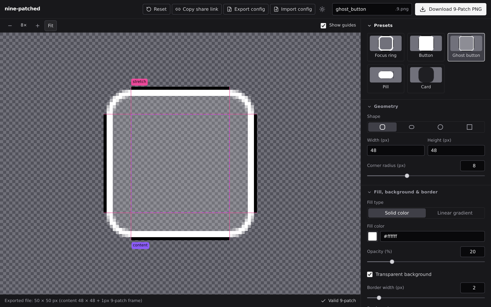

# nine-patched

9-patch images for Roku and Android, generated in your browser.

nine-patched creates valid `.9.png` assets without an image editor. Pick a shape, set the fill, border and regions, and download a correctly framed 9-patch PNG. It is built for Roku SceneGraph first (focus rings, buttons, `Poster` backgrounds). The format is shared with Android, so the same files work there.



## What is a 9-patch image?

A 9-patch is a normal PNG with a 1px metadata frame on all four sides. The frame is not part of the picture. It tells the renderer how to scale the image:

* The top and left edges mark the columns and rows that are allowed to stretch.
* The bottom and right edges mark the content (padding) box where inner text or icons sit.

One small source image can then scale to any size while its corners and borders stay crisp.

## Features

* Shapes: rounded rectangle, pill, ellipse or circle, and plain rectangle.
* Fill: a solid color with opacity, or a linear gradient with up to 12 stops, each with its own position and opacity. Angles use the CSS and Figma convention, so values paste in directly.
* Border drawn inside the shape, transparent or solid background.
* Stretch and content regions, each with an Auto mode that follows the corner radius and size.
* Presets for common Roku assets: focus ring, button, ghost button, pill and card, with one level of Undo.
* Warnings that still let you export: missing stretch markers, a corner radius the size cannot fit, and a stretch region whose pixels change along the stretch axis (for example a gradient), which looks uneven once stretched.
* Share links. The whole configuration lives in the URL hash, so a link reproduces the asset exactly. Configurations also export to and import from a small JSON file.
* Pixel accurate canvas with zoom, fit to stage, and guides for both regions.
* Light and dark themes, keyboard operable, checked with axe in both themes.
* Everything runs in the browser. Nothing is uploaded.

## Using the file on Roku

Put the file in your channel, keep the `.9.png` extension, and give the node the size you want. SceneGraph stretches only the marked regions.

```xml
<Poster uri="pkg:/images/button.9.png" width="400" height="96" />
```

Lists and grids take a 9-patch as their focus indicator. Roku's documentation says of `focusBitmapUri`: "In most cases, this should be a 9-patch image that specifies both expandable regions as well as margins."

```xml
<MarkupList focusBitmapUri="pkg:/images/focus_ring.9.png" />
```

For a `Poster`, Roku reads the content markers and exposes them in the `bitmapMargins` field, so your own layout code can place text inside the padding box.

Tips:

* Keep the source small. Corners and borders are copied at their authored size and never stretched, so the source only needs the corners plus a short stretchable strip.
* For a rounded background, leave the stretch region on Auto. It insets by the corner radius, so the corners never distort.
* Do not draw a 9-patch smaller than its fixed parts (the image size minus the stretch region on each axis).

## Using the file on Android

Place the file in `res/drawable` with the `.9.png` extension and use it as any drawable. The uniformity warning follows the same idea as the "bad patches" check in Android Studio's Draw 9-patch tool, with a small tolerance for anti-aliased edges.

## Getting started

```bash
npm install
npm run dev            # dev server on http://localhost:3000
npm run build          # production build into build/
npm run typecheck      # app and e2e type check
npm run test:coverage  # unit tests, src/core is held at 100 percent coverage
npm run test:e2e       # Playwright end to end tests (Chromium)
```

## How it is built

* React 18, TypeScript, Vite 6, Tailwind CSS v4, HTML5 Canvas. No backend.
* `src/core` holds all rendering and format logic as pure TypeScript with no DOM access at runtime: geometry, shapes, gradients, the renderer, configuration parsing, presets, warnings, 9-slice math and the uniformity check. It takes any object that looks like a 2D canvas context, so it can run outside a browser.
* `src/components` and `src/hooks` are the React UI. `src/lib` holds small browser helpers (share links, file import and export, zoom).
* The canvas is drawn at the true output size (content plus the 2px frame) and exported as it is. The frame only ever contains transparent or pure black pixels, which keeps the output a valid 9-patch.
* `e2e` holds the Playwright suite. It decodes the downloaded PNG and checks the markers pixel by pixel.

## Roadmap

* A command line renderer that shares `src/core` (`nine-patched render asset.9patch.json -o asset.9.png`).
* A minimum on screen size readout next to the export size.
* A stretched preview, once its output has been compared with a real Roku device.

## License

MIT, see [LICENSE](LICENSE). Copyright (c) 2026 Muhammad Sheharyar (Sherrylio).
